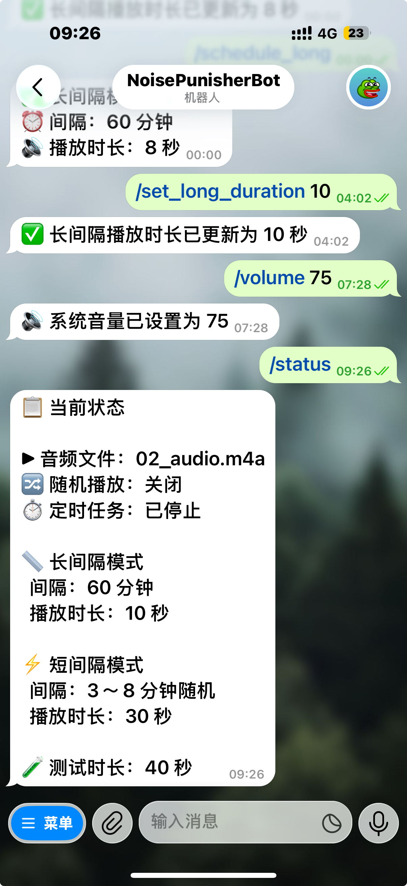
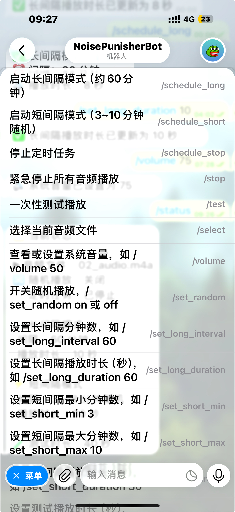

# AirCue

> **Sound back, stay calm.**
> 以声回击，保持优雅。

通过 Telegram 远程控制 macOS 本地音频定时播放的 Bot。

---

## 使用场景

手机 Telegram 作为遥控器，Mac 在家运行 Bot，蓝牙连接骨传导音响——随时发起，定时循环，优雅反制楼上噪音。

```
手机 TG  ──→  Telegram Bot  ──→  Mac（运行 AirCue）  ──→  骨传导蓝牙音响
```

---

## 环境要求

- macOS（依赖系统内置 `afplay`）
- Python 3.14+
- ffmpeg（可选，用于 mp4 转 m4a）

---

## 安装

```bash
# 进入项目目录（clone 下来的文件夹）
cd AirCue

# 创建虚拟环境
python3 -m venv venv

# 安装依赖
venv/bin/pip install -r requirements.txt

# 配置 .env
cp env.example .env
# 编辑 .env，填入 TG_BOT_TOKEN
```

---

## 配置（.env）

| 参数 | 默认值 | 说明 |
|------|--------|------|
| `TG_BOT_TOKEN` | — | BotFather 获取的 Token，必填 |
| `DEFAULT_AUDIO` | 02_audio.m4a | 默认音频文件名 |
| `LONG_INTERVAL_MINUTES` | 60 | 长间隔模式播放间隔（分钟） |
| `LONG_DURATION_SECONDS` | 60 | 长间隔模式每次播放时长（秒） |
| `SHORT_MIN` | 3 | 短间隔模式最小间隔，支持 `3`（分钟）、`3m`、`30s` |
| `SHORT_MAX` | 10 | 短间隔模式最大间隔，支持 `3`（分钟）、`3m`、`30s` |
| `SHORT_DURATION_SECONDS` | 30 | 短间隔模式每次播放时长（秒） |
| `TEST_DURATION_SECONDS` | 30 | 测试播放时长（秒） |
| `RANDOM_ENABLED` | off | 随机播放开关（on/off） |

---

## 音频文件

推荐去 [哔哩哔哩](https://www.bilibili.com) 搜索白噪音、自然音效、环境音等视频，用 [yt-dlp](https://github.com/yt-dlp/yt-dlp) 下载：

1. 在视频页面右键 → 复制链接，格式如：
   `https://www.bilibili.com/video/BV1VoBSYaEgi`
2. 用 yt-dlp 下载为 m4a 音频：

```bash
yt-dlp -x --audio-format m4a "https://www.bilibili.com/video/BV1VoBSYaEgi"
```

下载后重命名为 `01_audio.m4a`、`02_audio.m4a` 格式，放入项目根目录下的 `audio/` 文件夹：

```
AirCue/
└── audio/
    ├── 01_audio.m4a
    ├── 02_audio.m4a
    └── 03_audio.m4a
```

若下载的是 mp4 视频文件，用 ffmpeg 提取音频：
```bash
ffmpeg -i input.mp4 -vn -acodec copy output.m4a
```

`/select` 命令会动态扫描目录，新增文件无需重启。

---

## 启动 / 停止

```bash
./start.sh   # 启动
./stop.sh    # 停止
```

---

## 预览

| 状态面板 | 命令菜单 |
|:---:|:---:|
|  |  |

---

## 命令列表

### 调度
| 命令 | 说明 |
|------|------|
| `/schedule_long` | 启动长间隔模式（固定约60分钟） |
| `/schedule_short` | 启动短间隔模式（3~10分钟随机） |
| `/schedule_stop` | 停止定时任务 |

### 播放
| 命令 | 说明 |
|------|------|
| `/test` | 一次性测试播放 |
| `/stop` | 紧急停止所有音频 |
| `/select` | 选择音频文件 |
| `/volume [0-100]` | 查看或设置系统音量 |

### 配置
| 命令 | 说明 |
|------|------|
| `/set_random on/off` | 开关随机播放 |
| `/set_long_interval <分钟>` | 设置长间隔 |
| `/set_long_duration <秒>` | 设置长间隔播放时长 |
| `/set_short_min <时长>` | 设置短间隔最小值（如 `3` 表示3分钟，`30s` 表示30秒） |
| `/set_short_max <时长>` | 设置短间隔最大值（如 `10` 表示10分钟，`90s` 表示90秒） |
| `/set_short_duration <秒>` | 设置短间隔播放时长 |
| `/set_test_duration <秒>` | 设置测试播放时长 |
| `/status` | 查看当前状态 |
